# Loan Qualifier Application

Asks the users for their personal financial data. Once entered, the program will return how many, and which banks will qualify this user for a loan. The data the user needs to provide is credit score, amount of monthly debt, total monthly income, desired loan amount, and home value. 

---

## Technologies

This project leverages python 3.7 with the following packages:

**[fire](https://github.com/google/python-fire)** - For the command line interface, help page, and entry-point.

**[questionary](https://github.com/tmbo/questionary)** - For interactive user prompts and dialogs

---

## Installation Guide

Before running the application first install the following dependencies:

```python
pip install fire
pip install questionary
```

---

## Usage

To use the loan qualifier application simply clone the repository and run the **app.py** 

```python
python app.py
```

You will be prompted to enter the file path to the data sheet you'd like to work with:

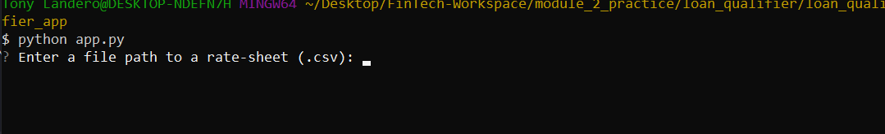

Type the name of the csv file (daily_rate_sheet.csv) you would like to work with:

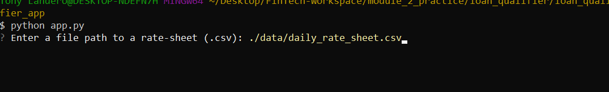

---

You will then be prompted to enter your credit score:

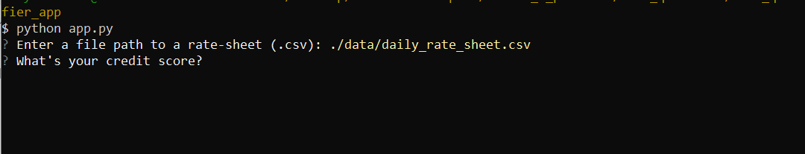

Enter a credit score of 700, like this:

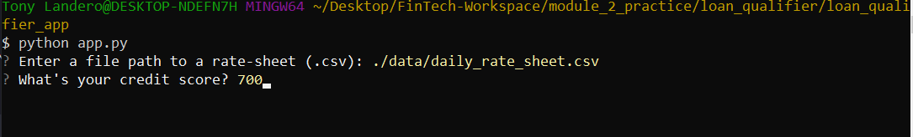

---

Next, you will be prompted to enter your monthly debt:

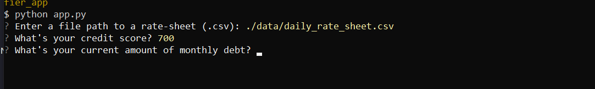

Enter a monthly debt amount of $2,500:

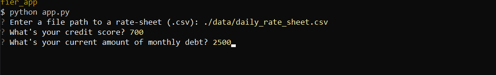

---

After that, you will be asked to enter a monthly income amount for the user:

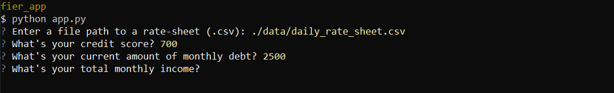

Enter a monthly income amount of $5,000:

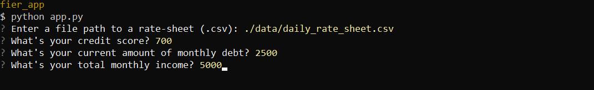

---

You will then be prompted to enter the amount of the desired loan:

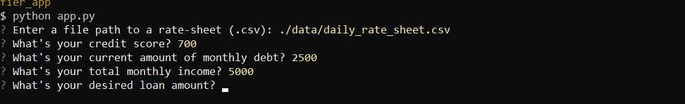

Enter a desired loan amount of $20,000:

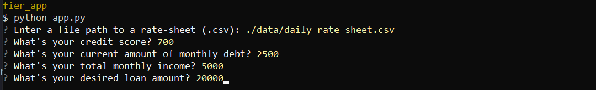

---

Finally, you will be prompted to enter the value of your home:

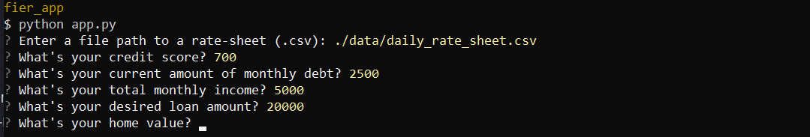

Enter a home value of $250,000:

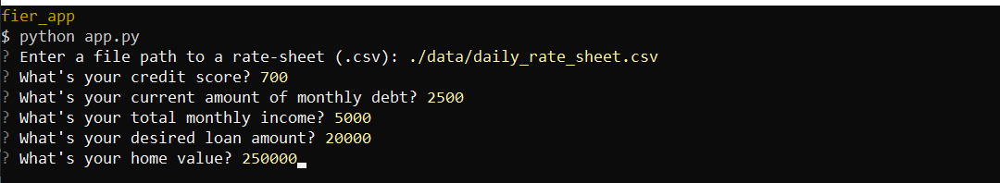

---

The application will inform you of the user's monthly debt-to-income ratio, the loan-to-value ratio, and **most importantly**, how many loans the user qualifies for:

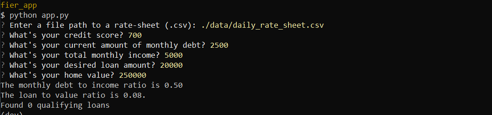

Once the program runs and the number of qualifying loans is displayed, the program ends.

---

## Contributors

In this section, list all the people who contribute to this project. You might want recruiters or potential collaborators to reach you, so include your contact email and, optionally, your LinkedIn or Twitter profile.

---

## License

When you share a project on a repository, especially a public one, it's important to choose the right license to specify what others can and can't with your source code and files. Use this section to include the license you want to use.
